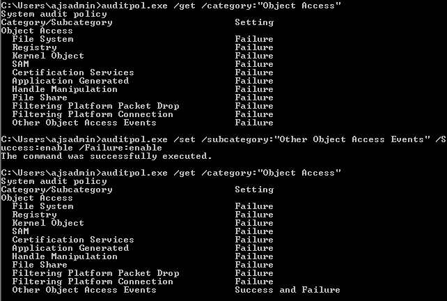
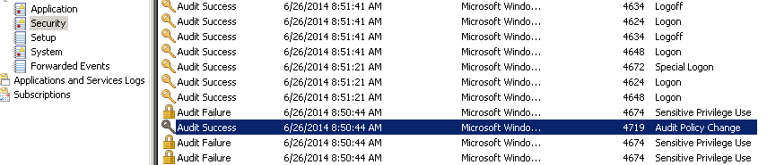
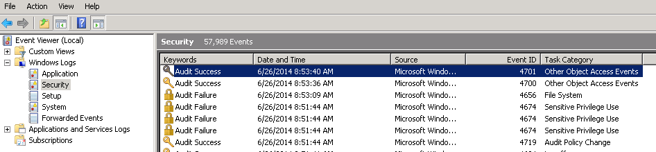
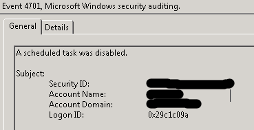
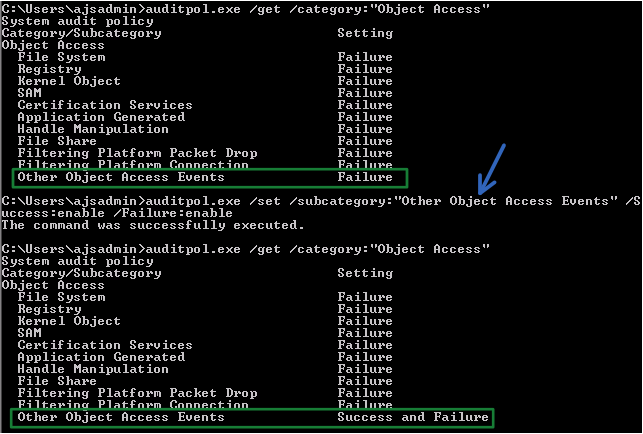

# Azure Management

PowerShell scripts for Azure administration and monitoring.

## Contents

- [Azure Site Recovery - Recovery Plan Audit](#azure-site-recovery---recovery-plan-audit)

---

## Azure Site Recovery - Recovery Plan Audit

**Published:** 2019-07-01  
**Tags:** Azure, ASR, Azure Site Recovery, PowerShell, DR  
**Script:** [`Get-ASRRecoveryPlanCoverage.ps1`](./Get-ASRRecoveryPlanCoverage.ps1)

### Overview

Azure doesn't have a native way to report on items in a Recovery Vault that are Replicated Items but not yet assigned to a Recovery Plan. This script audits all protected items in an Azure Site Recovery vault and identifies which servers are missing recovery plan assignments.

### What the Script Does

**Part 1 - Discovery**
1. Connect to the Azure Recovery Services Vault
2. Get the on-premises configuration server (fabric)
3. Query all protected servers
4. List all recovery plans in the vault

**Part 2 - Recovery Plan Inventory**
1. Loop through each recovery plan
2. Loop through groups in each plan
3. Build a complete list of all protected items assigned to recovery plans
4. Capture the recovery plan name and group assignment for each item

**Part 3 - Gap Analysis**
1. Identify protected items not found in any recovery plan
2. Add them to the report with blank plan and group fields

### Prerequisites

- Azure PowerShell module (`Az.RecoveryServices`)
- Azure account with permissions to read Recovery Services Vaults
- An existing Azure Site Recovery vault with protected items

### Usage

```powershell
# Update these variables for your environment
$ResourceGroup = "RG-DR"
$VaultName = "Vault-ASR-East"
$ConfigServer = "ConfigSvr01"

.\Get-ASRRecoveryPlanCoverage.ps1
```

**Output:**  
Grid view showing all protected VMs with their recovery plan assignments. VMs without a recovery plan will have blank RecoveryPlan and Group fields.


*Script connecting to Azure Site Recovery vault*


*Enumerating recovery plans and protected items*


*Identifying VMs missing recovery plan assignments*


*Complete ASR coverage report*


*Detailed recovery plan group assignments*

### Technical Notes

**GUID Complexity:**  
The GUIDs assigned to the protected item aren't necessarily the same as the "group protected item" ID, which is why the script needs to match them using the `ReplicationProtectedItemId` property.

**Az Module Commands Used:**
- `Get-AzRecoveryServicesVault` - Get the vault object
- `Set-AzRecoveryServicesAsrVaultContext` - Set context for subsequent commands
- `Get-AzRecoveryServicesAsrFabric` - Get configuration server (fabric)
- `Get-AzRecoveryServicesAsrProtectionContainer` - Get replication container
- `Get-AzRecoveryServicesAsrProtectableItem` - Get protected items
- `Get-AzRecoveryServicesAsrRecoveryPlan` - Get recovery plans

### Use Cases

1. **Compliance Auditing:** Ensure all disaster recovery protected servers have recovery plans
2. **Gap Analysis:** Identify servers that need recovery plan assignments
3. **Documentation:** Export the complete inventory of DR coverage
4. **Change Management:** Verify recovery plan assignments after configuration changes

---

*Originally published on Shep's IT Solutions blog*
