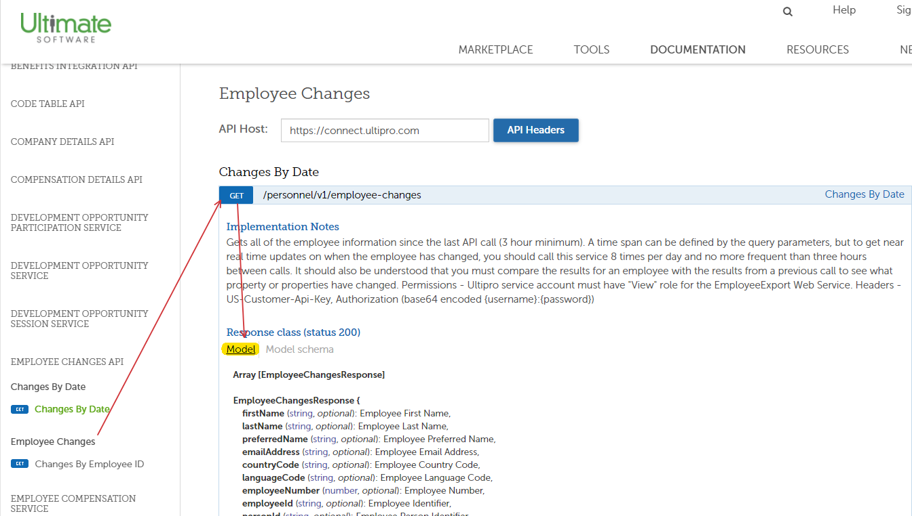
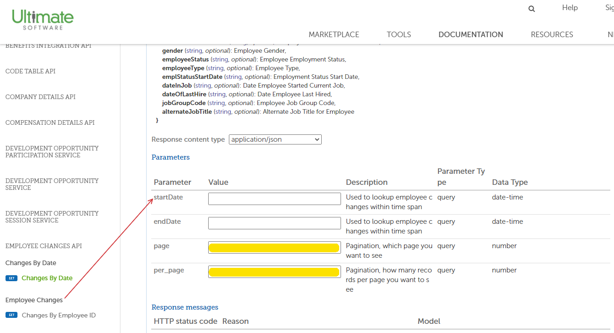
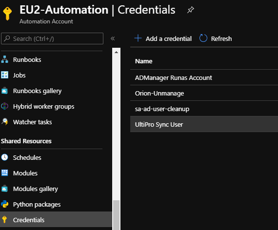
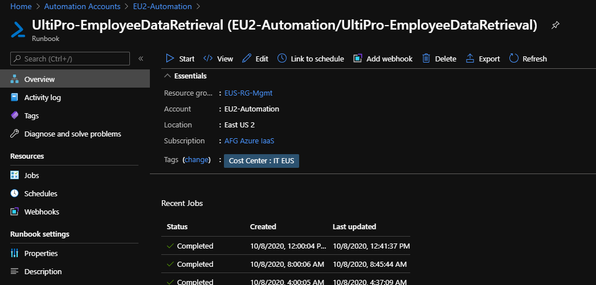
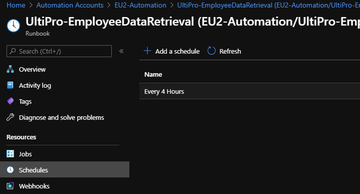
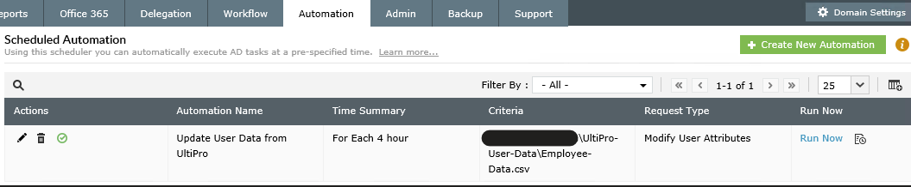

# UltiPro / UKG Pro Integration

PowerShell scripts for syncing user attributes from UltiPro (now UKG Pro) to Active Directory using REST APIs and Report-as-a-Service.

## ⚠️ Important - UltiPro is now UKG Pro

**Brand Change:** UltiPro was acquired by Ultimate Software, then merged with Kronos to form **UKG (Ultimate Kronos Group)**. The product is now called **UKG Pro**.

**API Changes:**
- REST API authentication upgraded to **OAuth 2.0** (from basic auth)
- Documentation moved to **developer.ukg.com**
- Report-as-a-Service API remains largely unchanged (SOAP-based)

## Contents

- [REST API Method (CSV Export)](#rest-api-method-csv-export)
- [Report-as-a-Service Method (SQL Import)](#report-as-a-service-method-sql-import)
- [API Migration Notes](#api-migration-notes)

---

## REST API Method (CSV Export)

**Published:** 2020-10-08  
**Tags:** PowerShell, UltiPro, UKG Pro, REST, API, Active Directory  
**Script:** [`Sync-UltiProToAD-CSV.ps1`](./Sync-UltiProToAD-CSV.ps1)

### Overview

Synchronizes user attributes from UKG Pro to Active Directory by querying multiple REST APIs and exporting to CSV for consumption by AD sync tools like ManageEngine ADManager.

This method uses three separate APIs to build a complete employee record:
1. **Employment Details API** - Job info, status, org levels
2. **Employee Changes API** - Personal info, contact details
3. **Org Levels API** - Department descriptions

### Architecture

```
UKG Pro APIs → PowerShell → CSV Export → ManageEngine ADManager → Active Directory
```

**Execution Environment:** Azure Automation Runbook with Hybrid Worker (for on-prem AD access)

### APIs Used

| API | Endpoint | Purpose |
|-----|----------|---------|
| Employment Details | `/personnel/v1/employment-details` | Active employees, job titles, org structure |
| Employee Changes | `/personnel/v1/employee-changes/{employeeId}` | Names, addresses, phone numbers |
| Org Levels | `/configuration/v1/org-levels` | Department names and codes |


*UKG Pro API configuration interface*


*API credential management*

### What the Script Does

1. **Query Employment Details** - Fetches all active employees (200 per page due to API limits)
2. **Query Org Levels** - Gets department descriptions for mapping
3. **Loop Through Employees** - For each employee:
   - Query Employee Changes API for personal details
   - Look up manager in AD by EmployeeID
   - Build complete attribute set
4. **Export to CSV** - Write results to network share
5. **ManageEngine Processes** - ADManager picks up CSV and updates AD

### Attributes Synced

- **Name Fields:** givenName, middleName, sn (surname)
- **Contact:** telephoneNumber, homePhone, streetAddress, city, state, postalCode
- **HR Data:** Title, Company, Department, EmployeeID, Division, Manager
- **Custom:** extensionAttribute11-13 (org level codes, status)

### Configuration

**Azure Automation Requirements:**

```powershell
# Credentials
- "UltiPro Sync User" - UKG Pro API service account
- "ADManager Runas Account" - File share access

# Variables (Update These)
$exportpath = "\\fileserver\share\UltiPro-User-Data"
$headers = @{'us-customer-api-key' = 'YOUR-API-KEY'}
```


*Azure Automation credential configuration*


*PowerShell runbook setup*


*Scheduling the sync runbook*


*ManageEngine ADManager automation workflow*

**⚠️ Authentication Update Required:**

The script uses basic authentication, but UKG Pro now requires **OAuth 2.0**. Update the authentication section:

```powershell
# OLD (Basic Auth)
Invoke-RestMethod -Credential $webserviceaccount -Headers $headers

# NEW (OAuth 2.0)
# First, get token
$tokenUrl = "https://service5.ultipro.com/oauth/token"
$tokenBody = @{
    grant_type = "client_credentials"
    client_id = $ClientId
    client_secret = $ClientSecret
}
$token = Invoke-RestMethod -Method Post -Uri $tokenUrl -Body $tokenBody

# Then use bearer token
$headers = @{
    'Authorization' = "Bearer $($token.access_token)"
    'US-API-Key' = $CustomerAPIKey
}
Invoke-RestMethod -Headers $headers
```

### Performance Notes

- **Pagination:** API limit of 200 records per request
- **Processing Time:** 20-30 minutes for large organizations
- **Scheduling:** Set runbook to run every 4 hours (balance freshness vs. API load)

### Use Cases

1. **HR Attribute Sync:** Keep AD in sync with HR system of record
2. **Manager Hierarchy:** Maintain reporting structure in AD
3. **Department Changes:** Auto-update when employees change departments
4. **New Hire Provisioning:** Populate AD attributes from HR data

---

## Report-as-a-Service Method (SQL Import)

**Published:** 2021-03-10  
**Tags:** PowerShell, UltiPro, UKG Pro, RaaS, SOAP, SQL Server  
**Script:** [`Sync-UltiProToAD-RaaS-SQL.ps1`](./Sync-UltiProToAD-RaaS-SQL.ps1)

### Overview

**Faster alternative to REST API for large datasets.** Uses UKG Pro's Report-as-a-Service (RaaS) SOAP API to execute custom Cognos Analytics reports and import results directly into SQL Server.

### Why Use This Method?

✅ **Performance:** Much faster for large datasets (session-based streaming vs. paginated REST)  
✅ **Custom Reports:** HR staff can author reports in Cognos Analytics  
✅ **Flexibility:** Pull any data available in Cognos reporting  
✅ **Security:** More granular control over exposed data (no SSN fields required)

### RaaS API Process

The Report-as-a-Service API requires **5 sequential steps** (don't skip any):

```
1. LogOn          → Create session, get ServiceID and Token
2. GetReportList  → Enumerate available reports
3. ExecuteReport  → Run the report, get ReportKey
4. RetrieveReport → Stream Base64-encoded results
5. LogOff         → End session
```

### Architecture

```
Cognos Report → RaaS API → Base64 Stream → PowerShell → SQL Server
                                                ↓
                                      AD Manager DN Lookup
                                                ↓
                                          SQL View → ManageEngine
```

### What the Script Does

**Part 1 - UKG Pro Data Retrieval**
1. LogOn to RaaS API with credentials
2. Get list of available reports
3. Execute the specified report by name
4. Retrieve Base64-encoded CSV stream
5. LogOff from API
6. Decode Base64 to CSV array

**Part 2 - AD Manager Lookup**
- Query AD for all users with EmployeeID
- Build manager DN reference table

**Part 3 - SQL Import**
- Create in-memory DataTable matching SQL schema
- Populate with UKG Pro data
- Execute stored procedure to import

**Part 4 - SQL Import (AD Data)**
- Create second DataTable for manager DNs
- Execute second stored procedure

### Configuration

**Azure Automation Variables:**

```powershell
'UltiPro Data Service URL'      # e.g., https://service5.ultipro.com/services/...
'UltiPro Streaming Service URL'  # e.g., https://service5.ultipro.com/services/...
'UltiPro Report Name'            # Name of Cognos report (case-sensitive)
'UltiPro ClientAccessKey'        # From UKG Pro admin
'UltiPro UserAccessKey'          # From UKG Pro admin
```

**Azure Automation Credentials:**

```powershell
'UltiPro Web API User'  # Service account with API access
```

**SQL Server Setup:**

```sql
-- Table 1: UltiPro employee data
CREATE TABLE dbo.UltiProEmployees (
    givenName NVARCHAR(50),
    middleName NVARCHAR(1),
    lastName NVARCHAR(50),
    -- ... (23 columns total, see script)
)

-- Table 2: AD manager distinguished names
CREATE TABLE dbo.ADDistinguishedNames (
    employeeID NVARCHAR(20),
    distName NVARCHAR(500)
)

-- View: Combined data for ManageEngine
CREATE VIEW dbo.vw_EmployeeSync AS
SELECT e.*, ad.distName AS ManagerDN
FROM dbo.UltiProEmployees e
LEFT JOIN dbo.ADDistinguishedNames ad
    ON e.ManagerEmployeeID = ad.employeeID

-- Stored Procedures
CREATE PROCEDURE dbo.ADSync_InsertAll @ADSyncT [ADSyncTableType] READONLY
-- Truncates and reloads UltiProEmployees table

CREATE PROCEDURE dbo.ADDist_InsertAll @ADDistT [ADDistTableType] READONLY
-- Truncates and reloads ADDistinguishedNames table
```

### Update Script

**Update SQL Server Names** (appears twice in script):

```powershell
# Line ~240 and ~320
$cnString = 'Integrated Security=SSPI;Persist Security Info=False;Initial Catalog=DBMaintenance;Data Source=YOUR-SQL-SERVER'
```

### Cognos Report Setup

The script expects a Cognos report with these columns:

| Column Name | Data Source |
|-------------|-------------|
| FirstName | Employee First Name |
| MiddleName | Employee Middle Name |
| LastName | Employee Last Name |
| WorkPhone | Work Phone Number |
| HomePhone | Home Phone Number |
| Address | Street Address |
| City | City |
| State | State |
| Zip | Postal Code |
| OrgLevel1Code | Division Code |
| OrgLevel2 | Department Name |
| OrgLevel2Code | Department Code |
| OrgLevel3Code | Sub-department Code |
| Title | Job Title |
| Company | Company Name |
| EmployeeNumber | Employee ID |
| EmployeeStatus | Employment Status Code |
| EmployeeNumberSupervisor | Manager's Employee ID |

### Performance Comparison

| Method | Dataset Size | Processing Time |
|--------|--------------|-----------------|
| REST API (CSV) | 1000+ employees | 20-30 minutes |
| RaaS (SQL) | 1000+ employees | 5-10 minutes |

**Winner:** RaaS for large organizations

---

## API Migration Notes

### REST API Changes (2024+)

**Authentication:**
- **Old:** Basic HTTP authentication with API key header
- **New:** OAuth 2.0 client credentials + API key header

**Documentation:**
- **Old:** `https://connect.ultipro.com/documentation`
- **New:** `https://developer.ukg.com/hcm/reference/welcome-to-the-ukg-pro-api`

**Endpoints:** ✅ Still valid
- `/personnel/v1/employment-details`
- `/personnel/v1/employee-changes/{employeeId}`
- `/configuration/v1/org-levels`

### Report-as-a-Service API

**Status:** ✅ No major changes

The RaaS SOAP API remains largely unchanged:
- Same 5-step process
- Same session-based authentication
- Same SOAP XML format
- Still supports Base64-encoded CSV/XML output

**Documentation:**
- https://developer.ukg.com/hcm/docs/reports-as-a-service
- https://library.ukg.com/a/207076

### Migration Checklist

- [ ] Update REST API scripts to use OAuth 2.0
- [ ] Update API key header name if changed
- [ ] Test authentication with new token endpoint
- [ ] Verify endpoint URLs (may change from service5.ultipro.com)
- [ ] Update documentation links in comments
- [ ] Test RaaS API (should work as-is)
- [ ] Update scheduled runbook frequency if needed

---

## Prerequisites

- **Azure Automation Account** (or Task Scheduler for on-prem)
- **Hybrid Worker** (for on-prem AD access)
- **UKG Pro Service Account** with API permissions:
  - Employee Person Details (View)
  - Employee Employment Details (View)
  - Compensation Details (View)
  - Platform Configuration Fields (View)
  - Company Details (View)
- **Customer API Key** from UKG Pro admin portal
- **SQL Server** (for RaaS method)
- **ManageEngine ADManager** (or equivalent AD sync tool)

## Security Considerations

1. **Credential Storage:** Use Azure Automation secure credentials
2. **API Permissions:** Grant minimum required view-only access
3. **Data Exposure:** Both methods avoid SSN and sensitive compensation data
4. **Network Security:** Use Hybrid Worker for secure on-prem connectivity
5. **Audit Trail:** Azure Automation logs all runbook executions

## Troubleshooting

### REST API Issues

**401 Unauthorized:**
- Check OAuth token generation
- Verify API key is valid
- Confirm service account has API access

**Empty Results:**
- Check pagination logic (200 record limit)
- Verify filter: `employeeStatusCode!=T` (exclude terminated)

### RaaS Issues

**Session Timeout:**
- Ensure LogOff is called
- Don't skip any of the 5 steps

**Base64 Decode Error:**
- Check delimiter header (`US-DELIMITER: ","`)
- Verify report output format in Cognos

**Report Not Found:**
- Report name is case-sensitive
- Use exact name from Cognos

## Resources

- [UKG Developer Hub](https://developer.ukg.com)
- [UKG Pro API Reference](https://developer.ukg.com/hcm/reference/welcome-to-the-ukg-pro-api)
- [Report-as-a-Service Documentation](https://developer.ukg.com/hcm/docs/reports-as-a-service)
- [UKG API Guide (Surety Systems)](https://www.suretysystems.com/insights/ukg-api-overview-your-ultimate-guide-to-api-documentation/)

---

*Originally published on Shep's IT Solutions blog (2020-2021)*
